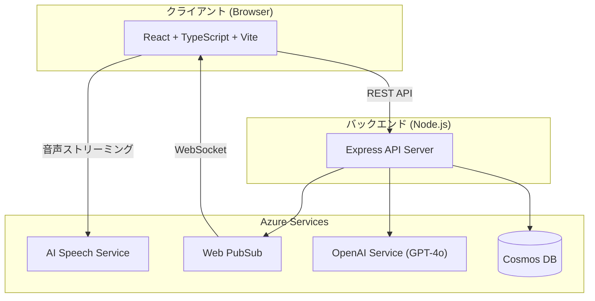

# 🎙️ TranscribeApp — リアルタイム文字起こし＆議事録要約

会議の音声をリアルタイムで文字起こしし、AI が自動で議事録を生成する Web アプリケーションです。

## ✨ 主な機能

- **リアルタイム文字起こし** — ブラウザのマイクから Azure AI Speech Service へ直接ストリーミングし、低遅延で文字起こし
- **話者分離** — ConversationTranscriber による話者識別で、誰が何を発言したかを自動判定
- **リアルタイム共有** — Azure Web PubSub により、同一セッションの全参加者に文字起こし結果を即時配信
- **AI 議事録生成** — Azure OpenAI (GPT-4o) がテキストを分析し、構造化された議事録（議題・決定事項・アクションアイテム）を自動生成
- **Markdown エクスポート** — 生成した議事録をマークダウン形式でダウンロード

## 🏗️ アーキテクチャ



## 📁 プロジェクト構成

```
transcribe-test/
├── client/          # フロントエンド (React + TypeScript + Vite)
├── server/          # バックエンド (Node.js + Express + TypeScript)
├── infra/           # インフラ (Terraform — Azure IaC)
└── docs/            # ドキュメント (要件定義書・設計書)
```

| ディレクトリ | 説明 | 詳細 |
|:---|:---|:---|
| `client/` | React SPA。文字起こし UI、セッション管理、議事録表示 | [client/README.md](./client/README.md) |
| `server/` | Express REST API。Azure サービス連携、データ永続化 | [server/.env.example](./server/.env.example) |
| `infra/` | Terraform で Azure リソースをプロビジョニング | [infra/README.md](./infra/README.md) |
| `docs/` | 要件定義書・設計書 | [要件書](./docs/requirements.md) / [設計書](./docs/design.md) |

## 🛠️ 技術スタック

### フロントエンド

| 技術 | 用途 |
|:---|:---|
| React 19 / TypeScript | UI フレームワーク |
| Vite 8 | ビルドツール |
| React Router 7 | ルーティング |
| Zustand 5 | 状態管理 |
| Axios | HTTP クライアント |
| Azure Speech SDK | 音声認識 |

### バックエンド

| 技術 | 用途 |
|:---|:---|
| Node.js 20 LTS / TypeScript | ランタイム |
| Express 4 | Web フレームワーク |
| Zod | バリデーション |
| winston | ロギング |
| @azure/cosmos | Cosmos DB クライアント |
| @azure/web-pubsub | Web PubSub クライアント |

### インフラ（Azure）

| サービス | 用途 | dev プラン |
|:---|:---|:---|
| App Service | バックエンドホスティング | F1 (Free) |
| Cosmos DB | データベース | Serverless |
| AI Speech Service | 文字起こし・話者分離 | F0 (Free) |
| OpenAI Service | 議事録要約生成 | S0 (従量課金) |
| Web PubSub | リアルタイム配信 | Free_F1 |
| Key Vault | シークレット管理 | Standard |
| Application Insights | 監視・ログ | 従量課金 |

## 🚀 クイックスタート

### 前提条件

- Node.js 20 以上
- npm
- Azure サブスクリプション（Azure サービスを使用する場合）

### 1. リポジトリのクローン

```bash
git clone <repository-url>
cd transcribe-test
```

### 2. バックエンドのセットアップ

```bash
cd server
npm install
cp .env.example .env
# .env に Azure サービスの接続情報を設定（後述）
npm run dev
```

サーバーが `http://localhost:3001` で起動します。

### 3. フロントエンドのセットアップ

```bash
cd client
npm install
npm run dev
```

ブラウザで `http://localhost:5173` を開きます。

### 4. Azure リソースのプロビジョニング（任意）

```bash
cd infra
terraform init
terraform plan -var-file=environments/dev.tfvars
terraform apply -var-file=environments/dev.tfvars
```

> 詳細は [infra/README.md](./infra/README.md) を参照してください。

## ⚙️ 環境変数

バックエンドの `.env` ファイルに以下を設定します（テンプレート: [server/.env.example](./server/.env.example)）。

| 変数 | 説明 | 必須 |
|:---|:---|:---:|
| `PORT` | サーバーポート（デフォルト: 3001） | — |
| `AZURE_SPEECH_KEY` | Speech Service API キー | ✅ |
| `AZURE_SPEECH_REGION` | Speech Service リージョン | ✅ |
| `AZURE_OPENAI_ENDPOINT` | OpenAI エンドポイント | ✅ |
| `AZURE_OPENAI_KEY` | OpenAI API キー | ✅ |
| `AZURE_OPENAI_DEPLOYMENT` | OpenAI デプロイメント名 | ✅ |
| `AZURE_PUBSUB_CONNECTION_STRING` | Web PubSub 接続文字列 | ✅ |
| `COSMOS_DB_ENDPOINT` | Cosmos DB エンドポイント | ✅ |
| `COSMOS_DB_KEY` | Cosmos DB キー | ✅ |

## 📖 API エンドポイント

| メソッド | パス | 説明 |
|:---|:---|:---|
| `POST` | `/api/sessions` | セッション作成 |
| `GET` | `/api/sessions` | セッション一覧 |
| `GET` | `/api/sessions/:id` | セッション詳細 |
| `PATCH` | `/api/sessions/:id` | セッション更新 |
| `DELETE` | `/api/sessions/:id` | セッション削除 |
| `POST` | `/api/sessions/:id/transcripts` | 文字起こし保存 |
| `GET` | `/api/sessions/:id/transcripts` | 文字起こし取得 |
| `POST` | `/api/sessions/:id/summary` | 要約生成 |
| `GET` | `/api/sessions/:id/summary` | 要約取得 |
| `PUT` | `/api/sessions/:id/summary` | 要約編集 |
| `GET` | `/api/speech/token` | Speech トークン取得 |
| `POST` | `/api/pubsub/negotiate` | PubSub 接続トークン取得 |

## 📄 ドキュメント

| ドキュメント | 内容 |
|:---|:---|
| [要件定義書](./docs/requirements.md) | 機能要件・非機能要件・データモデル・処理フロー |
| [設計書](./docs/design.md) | アーキテクチャ・フロントエンド/バックエンド設計・DB 設計・Azure 連携 |
| [インフラ README](./infra/README.md) | Terraform の使い方・リソース一覧・トラブルシューティング |
| [クライアント README](./client/README.md) | フロントエンドの構成・セットアップ・カスタムフック |

## 📜 ライセンス

MIT
