# リアルタイム文字起こし＆議事録要約 Web アプリケーション — 設計書

> **ドキュメントバージョン**: 1.0
> **作成日**: 2026-04-25
> **ステータス**: ドラフト
> **関連ドキュメント**: [要件定義書](./requirements.md)

---

## 1. システムアーキテクチャ

### 1.1 全体構成図

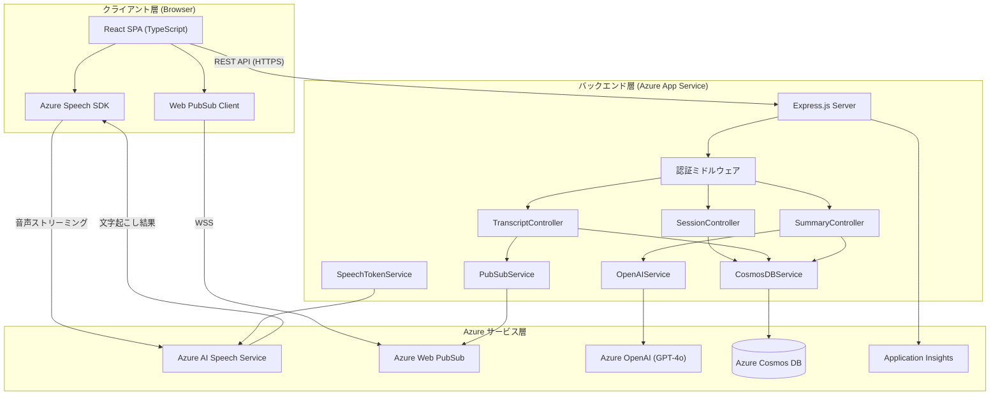

### 1.2 レイヤー構成

| レイヤー | 責務 |
|:---|:---|
| **プレゼンテーション層** | React コンポーネントによる UI 描画、ユーザー操作のハンドリング |
| **アプリケーション層** | Express ルーティング、コントローラーによるビジネスロジック制御 |
| **サービス層** | 各 Azure サービスとの通信を抽象化するサービスクラス群 |
| **データアクセス層** | Cosmos DB への CRUD 操作を担う Repository パターン |

---

## 2. フロントエンド設計

### 2.1 技術構成

| 項目 | 技術 | バージョン |
|:---|:---|:---|
| UI フレームワーク | React | 18+ |
| 言語 | TypeScript | 5.x |
| ビルドツール | Vite | 6.x |
| ルーティング | React Router | 7.x |
| 状態管理 | Zustand | 5.x |
| HTTP クライアント | Axios | 1.x |
| Speech SDK | microsoft-cognitiveservices-speech-sdk | latest |
| スタイリング | CSS Modules | — |

### 2.2 ディレクトリ構成

```
client/
├── public/
├── src/
│   ├── components/          # 共通UIコンポーネント
│   │   ├── Header/
│   │   ├── Button/
│   │   ├── Modal/
│   │   └── Loading/
│   ├── features/            # 機能別モジュール
│   │   ├── session/
│   │   │   ├── components/  # セッション固有コンポーネント
│   │   │   ├── hooks/       # カスタムフック
│   │   │   ├── stores/      # Zustand ストア
│   │   │   └── types.ts
│   │   ├── transcript/
│   │   │   ├── components/
│   │   │   ├── hooks/
│   │   │   ├── stores/
│   │   │   └── types.ts
│   │   └── summary/
│   │       ├── components/
│   │       ├── hooks/
│   │       ├── stores/
│   │       └── types.ts
│   ├── hooks/               # グローバルカスタムフック
│   ├── lib/                 # ユーティリティ・API クライアント
│   │   ├── api.ts
│   │   ├── speechClient.ts
│   │   └── pubsubClient.ts
│   ├── pages/               # ページコンポーネント
│   │   ├── DashboardPage.tsx
│   │   ├── SessionCreatePage.tsx
│   │   ├── SessionPage.tsx
│   │   └── SummaryPage.tsx
│   ├── App.tsx
│   ├── main.tsx
│   └── router.tsx
├── index.html
├── vite.config.ts
├── tsconfig.json
└── package.json
```

### 2.3 コンポーネント構成図

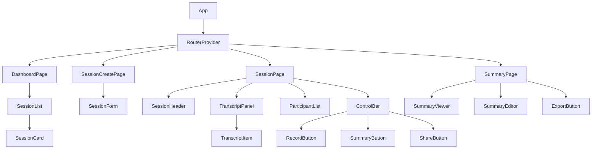

### 2.4 主要カスタムフック

| フック名 | 責務 |
|:---|:---|
| `useSpeechTranscriber` | Azure Speech SDK の初期化・音声キャプチャ・文字起こし結果受信を管理 |
| `usePubSub` | Web PubSub への WebSocket 接続・メッセージ受信・自動再接続を管理 |
| `useSession` | セッション CRUD 操作の API 呼び出しとローカル状態管理 |
| `useTranscriptStore` | 文字起こしログの Zustand ストアへの読み書き |
| `useSummary` | 要約の生成リクエスト・取得・編集状態を管理 |

### 2.5 状態管理設計

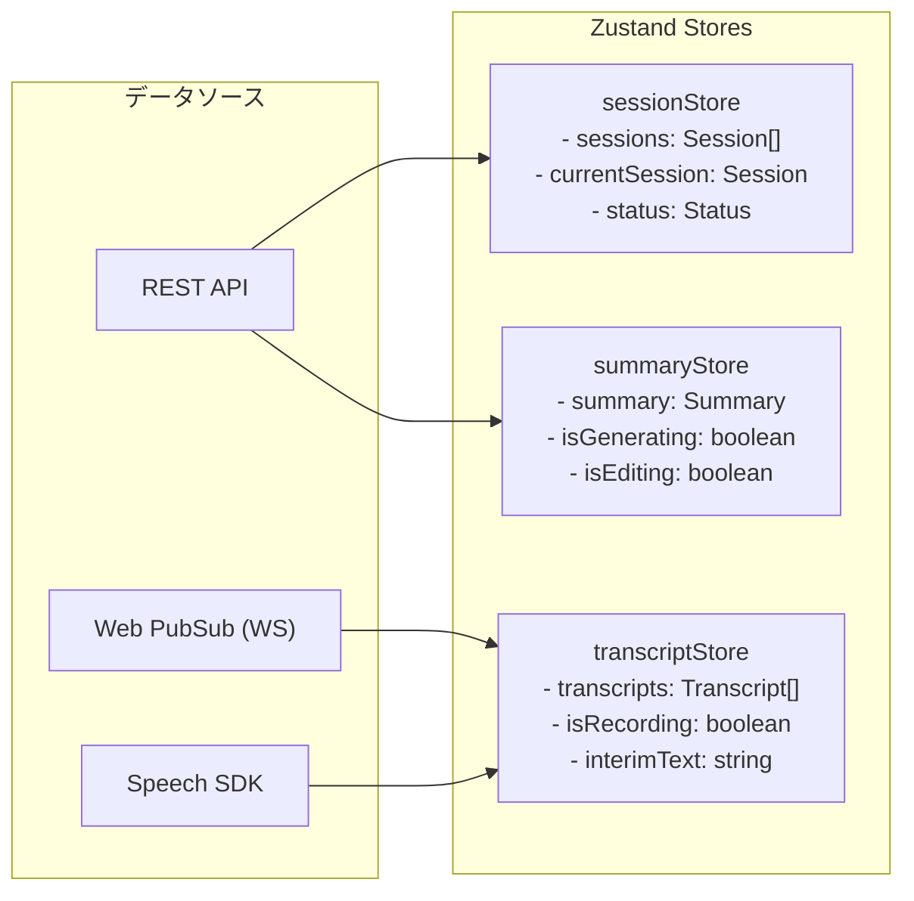

### 2.6 画面遷移図

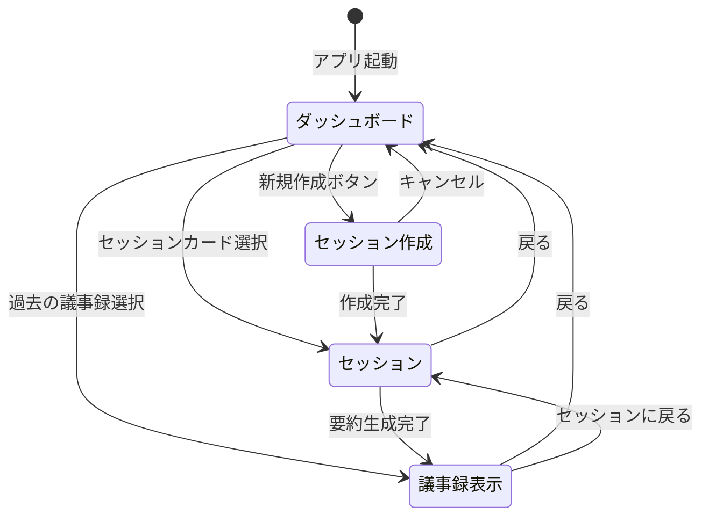

---

## 3. バックエンド設計

### 3.1 技術構成

| 項目 | 技術 |
|:---|:---|
| ランタイム | Node.js 20 LTS |
| フレームワーク | Express 4.x |
| 言語 | TypeScript 5.x |
| バリデーション | Zod |
| ロギング | winston |
| テスト | Jest + supertest |

### 3.2 ディレクトリ構成

```
server/
├── src/
│   ├── controllers/
│   │   ├── sessionController.ts
│   │   ├── transcriptController.ts
│   │   ├── summaryController.ts
│   │   └── tokenController.ts
│   ├── services/
│   │   ├── cosmosDBService.ts
│   │   ├── pubsubService.ts
│   │   ├── speechTokenService.ts
│   │   └── openAIService.ts
│   ├── repositories/
│   │   ├── sessionRepository.ts
│   │   ├── transcriptRepository.ts
│   │   └── summaryRepository.ts
│   ├── middlewares/
│   │   ├── auth.ts
│   │   ├── errorHandler.ts
│   │   ├── requestLogger.ts
│   │   └── validator.ts
│   ├── routes/
│   │   ├── index.ts
│   │   ├── sessionRoutes.ts
│   │   ├── transcriptRoutes.ts
│   │   ├── summaryRoutes.ts
│   │   └── tokenRoutes.ts
│   ├── models/
│   │   ├── session.ts
│   │   ├── transcript.ts
│   │   └── summary.ts
│   ├── config/
│   │   ├── azure.ts
│   │   ├── cosmos.ts
│   │   └── env.ts
│   ├── utils/
│   │   ├── logger.ts
│   │   ├── chunkText.ts
│   │   └── promptBuilder.ts
│   ├── app.ts
│   └── server.ts
├── tests/
├── tsconfig.json
└── package.json
```

### 3.3 API 詳細設計

#### 3.3.1 セッション管理 API

**POST /api/sessions** — 新規セッション作成

```typescript
// リクエスト
interface CreateSessionRequest {
  title: string;
  participants: { name: string }[];
  language?: string; // default: "ja-JP"
}

// レスポンス (201 Created)
interface SessionResponse {
  id: string;
  title: string;
  status: "preparing" | "active" | "ended";
  shareUrl: string;
  participants: Participant[];
  language: string;
  createdAt: string;
}
```

**PATCH /api/sessions/:id** — セッション更新

```typescript
// リクエスト
interface UpdateSessionRequest {
  title?: string;
  status?: "preparing" | "active" | "ended";
  participants?: { name: string }[];
}
```

#### 3.3.2 文字起こし API

**POST /api/sessions/:id/transcripts** — 文字起こし結果保存

```typescript
// リクエスト
interface CreateTranscriptRequest {
  speakerId: string;
  speakerName: string;
  text: string;
  offsetMs: number;
  isFinal: boolean;
}
```

保存後、PubSubService 経由で同一セッションの全クライアントにブロードキャスト。

#### 3.3.3 要約 API

**POST /api/sessions/:id/summary** — 要約生成

```typescript
// レスポンス (200 OK)
interface SummaryResponse {
  id: string;
  sessionId: string;
  title: string;
  meetingDate: string;
  participants: string[];
  agenda: string[];
  decisions: string[];
  actionItems: ActionItem[];
  discussionSummary: string;
  generatedAt: string;
}
```

#### 3.3.4 トークン API

**GET /api/speech/token** — Speech Service トークン取得

```typescript
// レスポンス
interface SpeechTokenResponse {
  token: string;
  region: string;
  expiresAt: string; // 10分間有効
}
```

**POST /api/pubsub/negotiate** — Web PubSub 接続トークン取得

```typescript
// リクエスト
interface PubSubNegotiateRequest {
  sessionId: string;
  userId: string;
}

// レスポンス
interface PubSubNegotiateResponse {
  url: string; // WebSocket 接続 URL (トークン付き)
}
```

### 3.4 ミドルウェア構成

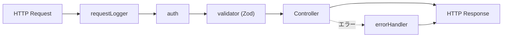

### 3.5 エラーハンドリング設計

| HTTP ステータス | エラー種別 | 用途 |
|:---:|:---|:---|
| 400 | `ValidationError` | リクエストパラメータ不正 |
| 401 | `UnauthorizedError` | 認証トークン不正・期限切れ |
| 404 | `NotFoundError` | セッション・リソースが存在しない |
| 409 | `ConflictError` | セッション状態の不整合 |
| 429 | `RateLimitError` | API 呼び出し制限超過 |
| 500 | `InternalError` | サーバー内部エラー |
| 503 | `ServiceUnavailableError` | Azure サービスへの接続失敗 |

```typescript
// 統一エラーレスポンス形式
interface ErrorResponse {
  error: {
    code: string;
    message: string;
    details?: unknown;
  };
  requestId: string;
  timestamp: string;
}
```

---

## 4. データベース設計（Cosmos DB）

### 4.1 コンテナ設計

| コンテナ名 | パーティションキー | 用途 |
|:---|:---|:---|
| `sessions` | `/id` | セッション・文字起こし・要約のすべてを格納 |

> **設計方針**: セッション単位でパーティショニングし、同一セッション内のデータ（メタ情報・文字起こしログ・要約）を同一パーティションに格納することで、クエリ効率を最大化する。

### 4.2 ドキュメント ER 図

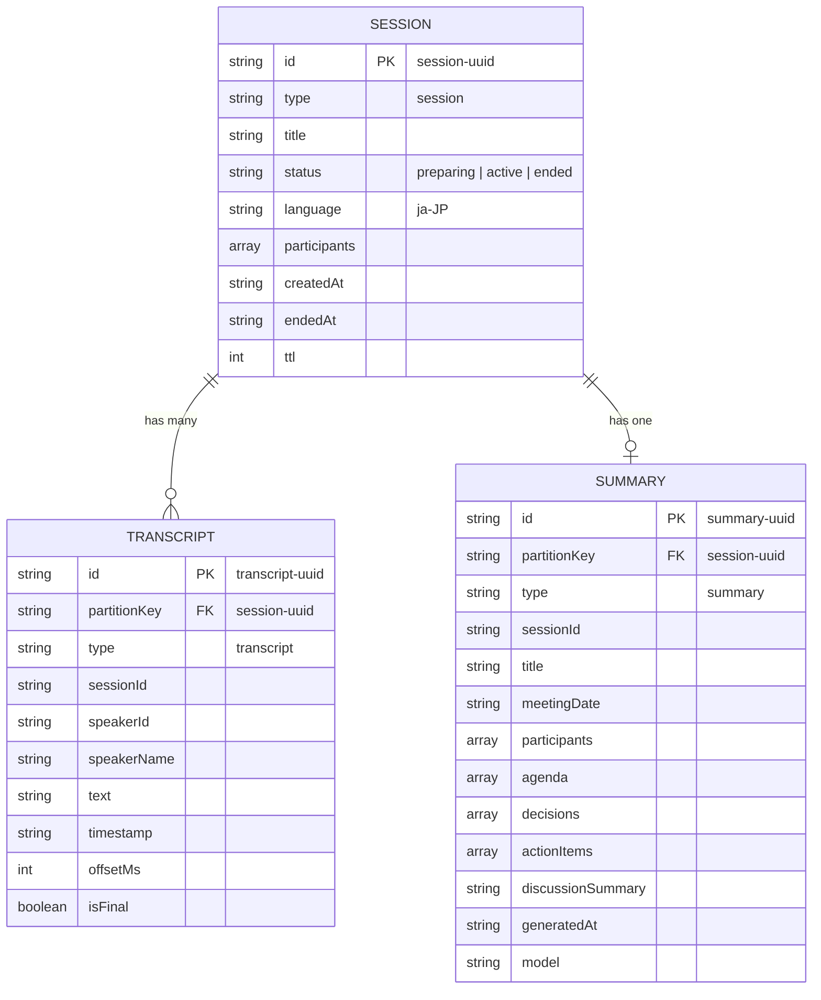

### 4.3 インデックスポリシー

```json
{
  "indexingMode": "consistent",
  "automatic": true,
  "includedPaths": [
    { "path": "/type/?" },
    { "path": "/sessionId/?" },
    { "path": "/status/?" },
    { "path": "/createdAt/?" },
    { "path": "/timestamp/?" }
  ],
  "excludedPaths": [
    { "path": "/text/*" },
    { "path": "/discussionSummary/*" },
    { "path": "/*" }
  ],
  "compositeIndexes": [
    [
      { "path": "/sessionId", "order": "ascending" },
      { "path": "/timestamp", "order": "ascending" }
    ]
  ]
}
```

### 4.4 主要クエリ

| 操作 | クエリ | 備考 |
|:---|:---|:---|
| セッション一覧取得 | `SELECT * FROM c WHERE c.type = 'session'` | インデックス制限回避のため、取得後にアプリ側で `createdAt` 降順ソート |
| セッション内の文字起こし全取得 | `SELECT * FROM c WHERE c.type = 'transcript' AND c.sessionId = @sid` | 取得後にアプリ側で `offsetMs` 昇順ソート |
| セッションの要約取得 | `SELECT * FROM c WHERE c.type = 'summary' AND c.sessionId = @sid` | |

> **注意**: パフォーマンス向上のため `excluded_path "/*"` を設定しているコンテナでは、`ORDER BY` に必要なレンジインデックスが不足する場合がある。その際はアプリケーション側でのソートを採用する。


---

## 5. Azure サービス連携設計

### 5.1 Azure AI Speech Service

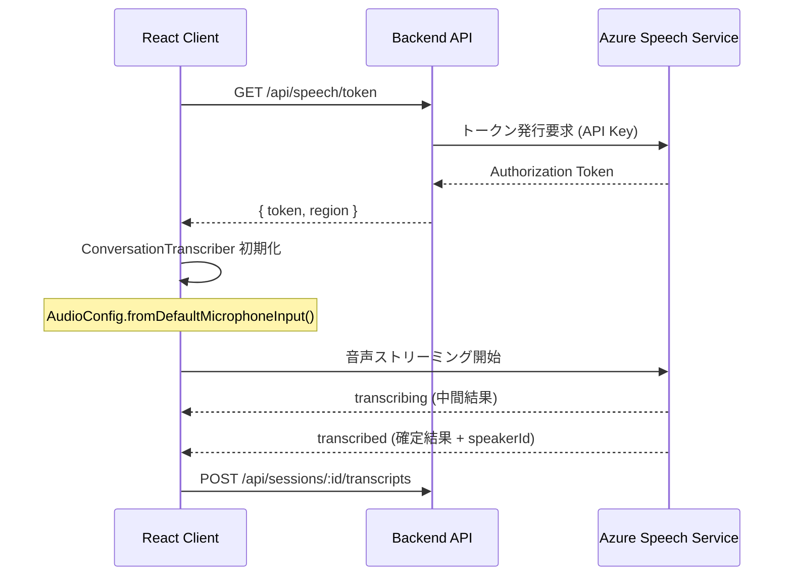

**ConversationTranscriber 初期化パラメータ**:

```typescript
const speechConfig = SpeechConfig.fromAuthorizationToken(token, region);
speechConfig.speechRecognitionLanguage = "ja-JP";
speechConfig.setProperty(
  PropertyId.SpeechServiceResponse_DiarizeIntermediateResults,
  "true"
);
```

### 5.2 Azure Web PubSub

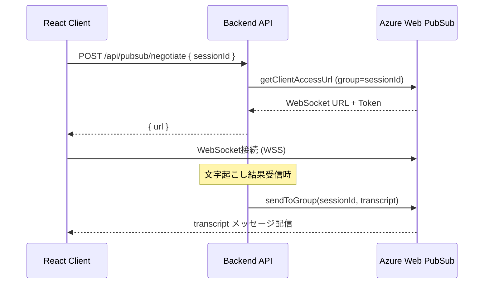

**メッセージ形式**:

```typescript
interface PubSubMessage {
  type: "transcript" | "sessionUpdate" | "summaryReady";
  payload: TranscriptPayload | SessionUpdatePayload | SummaryReadyPayload;
  timestamp: string;
  senderId: string;
}
```

### 5.3 Azure OpenAI Service

**要約生成プロンプト設計**:

```typescript
const SYSTEM_PROMPT = `
あなたは会議の議事録を作成する専門家です。
以下の文字起こしテキストから、構造化された議事録をJSON形式で生成してください。

出力形式:
{
  "title": "会議タイトル",
  "agenda": ["議題1", "議題2"],
  "decisions": ["決定事項1", "決定事項2"],
  "actionItems": [
    { "assignee": "担当者名", "task": "タスク内容", "dueDate": "期限" }
  ],
  "discussionSummary": "議論の要旨（500文字以内）"
}

注意事項:
- 事実に基づいた内容のみ記載すること
- 発言者を正確に特定すること
- アクションアイテムは具体的に記載すること
`;
```

**チャンク分割戦略**:

| パラメータ | 値 |
|:---|:---|
| 最大トークン数/チャンク | 100,000 tokens |
| オーバーラップ | 500 tokens |
| 分割単位 | 話者の発言区切り |

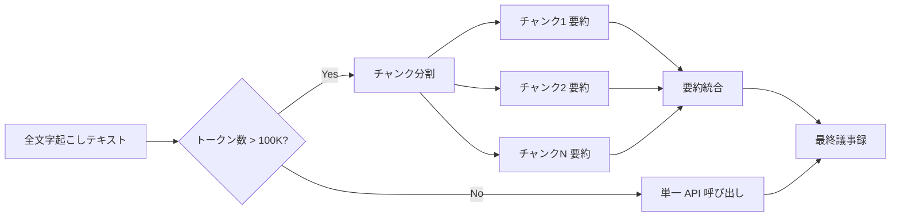

---

## 6. セキュリティ設計

### 6.1 認証・認可フロー

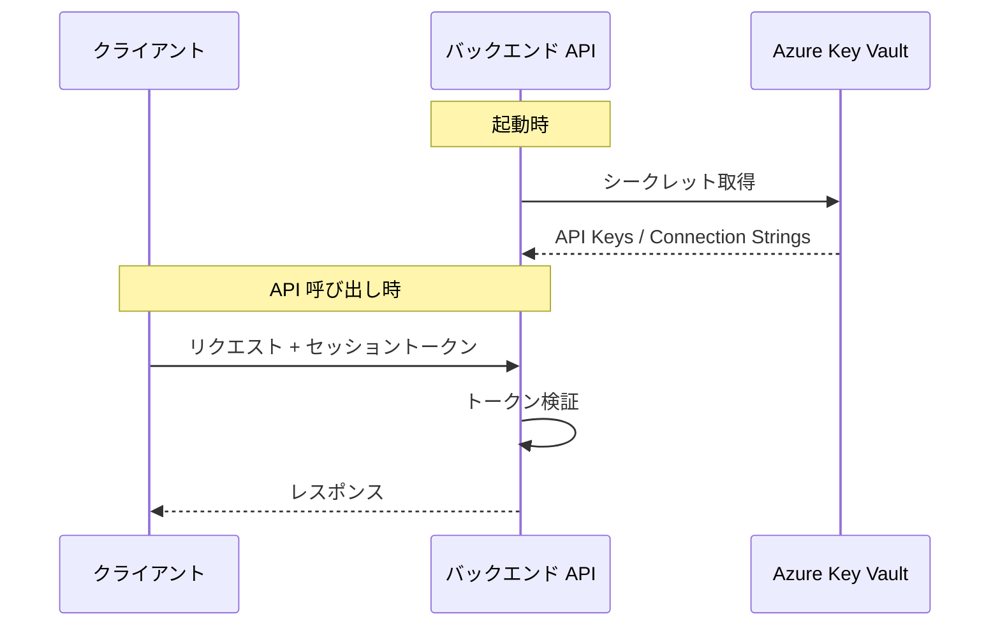

### 6.2 シークレット管理

| シークレット | 管理方法 |
|:---|:---|
| Speech Service API Key | Azure Key Vault |
| OpenAI API Key | Azure Key Vault |
| Cosmos DB Connection String | Azure Key Vault |
| Web PubSub Connection String | Azure Key Vault |
| Session Secret | 環境変数（App Service 設定） |

### 6.3 通信セキュリティ

| リソース | SKU / プラン | 備考 |
|:---|:---|:---|
| Azure AI Speech Service | S0（Standard） | ConversationTranscriber、話者分離対応 |
| Azure OpenAI Service | Standard | GPT-4o モデルデプロイ |
| Azure Web PubSub | Free_F1 | 開発時は Free、WebSocket に対応 |
| Azure App Service | B1 | japaneast でのクォータ制限回避および WebSocket 対応のため B1 を使用 |
| Azure Cosmos DB | Serverless | 低コスト運用。インデックス制限に注意 |
| Azure Application Insights | — | 監視・ログ収集 |
 API Key ヘッダー認証 |

---

## 7. デプロイメント設計

### 7.1 環境構成

| 環境 | 用途 | Azure リソースグループ |
|:---|:---|:---|
| Development | ローカル開発・テスト | `rg-transcribe-dev` |
| Staging | 統合テスト・UAT | `rg-transcribe-stg` |
| Production | 本番運用 | `rg-transcribe-prod` |

### 7.2 CI/CD パイプライン

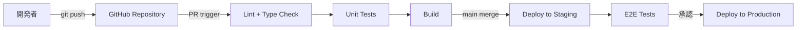

### 7.3 Terraform リソース構成

```
infra/
├── main.tf
├── variables.tf
├── outputs.tf
├── modules/
│   ├── app_service/
│   ├── cosmos_db/
│   ├── speech_service/
│   ├── openai_service/
│   ├── web_pubsub/
│   └── key_vault/
└── environments/
    ├── dev.tfvars
    ├── stg.tfvars
    └── prod.tfvars
```

---

## 8. 監視・ログ設計

### 8.1 Application Insights メトリクス

| メトリクス | 閾値 | アラート |
|:---|:---|:---|
| API レスポンスタイム (P95) | > 2,000 ms | Warning |
| API エラーレート | > 5% | Critical |
| WebSocket 切断率 | > 10% | Warning |
| Cosmos DB RU 消費率 | > 80% | Warning |
| Speech Service エラー率 | > 3% | Critical |

### 8.2 構造化ログ形式

```typescript
interface LogEntry {
  level: "info" | "warn" | "error";
  message: string;
  requestId: string;
  sessionId?: string;
  userId?: string;
  duration?: number;
  error?: {
    name: string;
    message: string;
    stack?: string;
  };
  timestamp: string;
}
```

---

## 9. テスト戦略

| テスト種別 | ツール | 対象 | カバレッジ目標 |
|:---|:---|:---|:---:|
| 単体テスト | Jest | Services / Repositories / Utils | 80% |
| コンポーネントテスト | React Testing Library | React コンポーネント | 70% |
| API 統合テスト | supertest | Express ルート + コントローラー | 90% |
| E2E テスト | Playwright | 主要ユーザーフロー | 主要フロー100% |

---

## 付録: 環境変数一覧

| 変数名 | 説明 | 形式の注意 |
|:---|:---|:---|
| `PORT` | サーバーポート | `3001` |
| `NODE_ENV` | 実行環境 | `development` |
| `AZURE_SPEECH_KEY` | Speech Service API Key | |
| `AZURE_SPEECH_REGION` | Speech Service リージョン | `japaneast` |
| `AZURE_OPENAI_ENDPOINT` | OpenAI エンドポイント | **ベースURLのみ** (例: `https://xxx.api.cognitive.microsoft.com`) |
| `AZURE_OPENAI_KEY` | OpenAI API Key | |
| `AZURE_OPENAI_DEPLOYMENT` | デプロイメント名 | `gpt-4o` |
| `AZURE_PUBSUB_CONNECTION_STRING` | Web PubSub 接続文字列 | `Endpoint=https://...` で始まる形式 |
| `AZURE_PUBSUB_HUB_NAME` | Web PubSub ハブ名 | `transcription` |
| `COSMOS_DB_ENDPOINT` | Cosmos DB エンドポイント | **URLのみ** (例: `https://xxx.documents.azure.com:443/`) |
| `COSMOS_DB_KEY` | Cosmos DB キー | |
| `COSMOS_DB_DATABASE` | データベース名 | `transcribe-app` |
| `COSMOS_DB_CONTAINER` | コンテナ名 | `sessions` |

