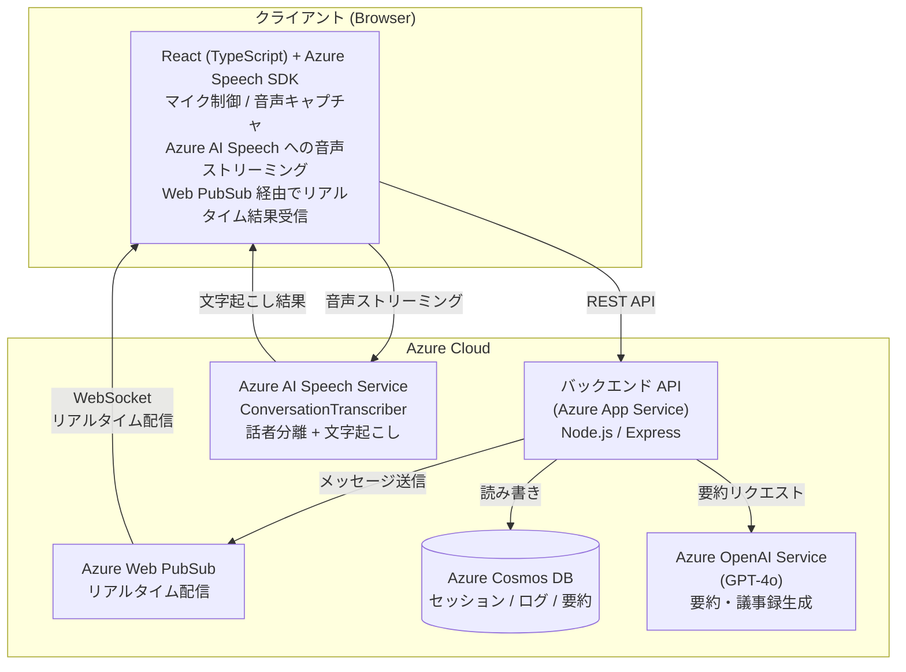
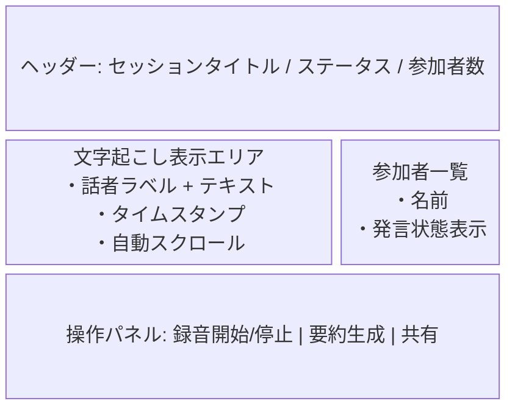
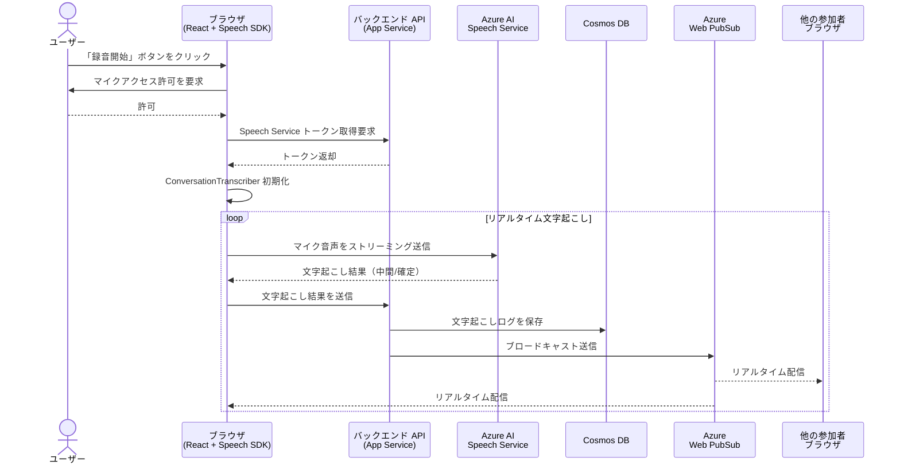
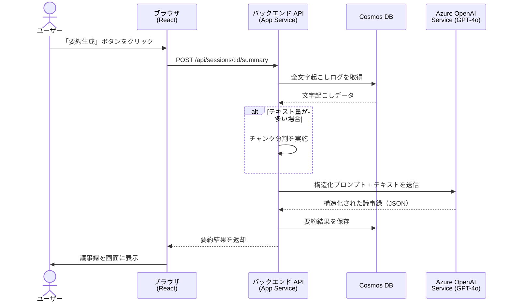

# リアルタイム文字起こし＆議事録要約 Web アプリケーション — 要件定義書

> **ドキュメントバージョン**: 1.0  
> **作成日**: 2026-04-25  
> **ステータス**: ドラフト

---

## 1. プロジェクト概要

### 1.1 目的

会議やミーティングの音声をリアルタイムで文字起こしし、その内容を AI によって自動要約・議事録化する Web アプリケーションを開発する。  
参加者全員がブラウザ上でリアルタイムに文字起こし結果を確認でき、会議終了後には構造化された議事録を即座に取得できることを目指す。

### 1.2 背景・課題

| 課題 | 説明 |
|------|------|
| 手動の議事録作成コスト | 会議中のメモ取りは集中力を削ぎ、記録漏れが発生しやすい |
| 情報共有の遅延 | 議事録作成に時間がかかり、決定事項の共有が遅れる |
| 話者の特定が困難 | 誰が何を発言したかの記録が曖昧になりやすい |

### 1.3 スコープ

#### スコープ内（MVP）

- ブラウザからのマイク音声入力によるリアルタイム文字起こし
- 話者分離（Speaker Diarization）
- 複数クライアントへのリアルタイム配信
- AI による議事録要約生成
- セッション（会議）の作成・管理
- 文字起こしログ・要約結果の永続化

#### スコープ外（将来検討）

- モバイルネイティブアプリ対応
- 多言語同時翻訳
- 録音ファイルのアップロードによるバッチ文字起こし
- 外部カレンダーとの連携
- ユーザー認証・権限管理の高度な実装（SSO、RBAC 等）

---

## 2. 技術スタック

### 2.1 アーキテクチャ構成図



### 2.2 コンポーネント一覧

| コンポーネント | 推奨 Azure サービス / 技術要素 | 役割・選定理由 |
|:---|:---|:---|
| **クライアント** | React (TypeScript) + Azure Speech SDK | デバイスのマイク制御と、Azure AI Speech への直接的な音声ストリーミング処理を担当 |
| **AI（音声処理）** | Azure AI Speech Service | `ConversationTranscriber` による低遅延な文字起こしと話者分離を実行 |
| **リアルタイム通信** | Azure Web PubSub（または SignalR） | バックエンドから全クライアントの画面へ、文字起こし結果をリアルタイムにブロードキャスト配信 |
| **バックエンド API** | Azure App Service（または Azure Functions） | セッション管理、認証、Web PubSub へのメッセージ送信、OpenAI API の呼び出し制御 |
| **AI（要約処理）** | Azure OpenAI Service (GPT-4o) | 蓄積されたテキストから高精度な要約・議事録を生成 |
| **データベース** | Azure Cosmos DB | 非構造化データ（JSON 形式のチャットログや要約結果）の高速な書き込みと読み込みに最適 |

---

## 3. 機能要件

### 3.1 セッション管理

| ID | 要件 | 優先度 |
|:---|:---|:---:|
| F-SM-001 | ユーザーは新しい会議セッションを作成できること | 必須 |
| F-SM-002 | セッション作成時にタイトル・参加者名を設定できること | 必須 |
| F-SM-003 | セッション一覧を表示し、過去のセッションを参照できること | 必須 |
| F-SM-004 | セッションに対して一意の共有用 URL が生成されること | 必須 |
| F-SM-005 | 共有 URL から他の参加者がセッションに参加できること | 必須 |
| F-SM-006 | セッションのステータス管理（準備中 / 進行中 / 終了）ができること | 必須 |

### 3.2 リアルタイム文字起こし

| ID | 要件 | 優先度 |
|:---|:---|:---:|
| F-TR-001 | ブラウザのマイクから音声を取得し、Azure AI Speech Service へストリーミング送信できること | 必須 |
| F-TR-002 | Azure Speech SDK の `ConversationTranscriber` を使用し、話者分離付きで文字起こしを行うこと | 必須 |
| F-TR-003 | 文字起こし結果（中間結果・確定結果）をリアルタイムに画面上に表示すること | 必須 |
| F-TR-004 | 話者ごとに異なる色やラベルで発言を視覚的に区別できること | 必須 |
| F-TR-005 | 文字起こし結果にタイムスタンプが付与されること | 必須 |
| F-TR-006 | Azure Web PubSub を経由して、同一セッションの全参加者に文字起こし結果がリアルタイム配信されること | 必須 |
| F-TR-007 | 文字起こし中にネットワーク断が発生した場合、自動再接続を試みること | 推奨 |
| F-TR-008 | 日本語の文字起こしに対応すること（`ja-JP` ロケール） | 必須 |

### 3.3 議事録要約生成

| ID | 要件 | 優先度 |
|:---|:---|:---:|
| F-SU-001 | セッション終了後に、蓄積された文字起こしテキストを Azure OpenAI Service (GPT-4o) に送信し、要約を生成できること | 必須 |
| F-SU-002 | 要約は以下の構造化された形式で出力されること：会議タイトル / 日時 / 参加者 / アジェンダ / 決定事項 / アクションアイテム / 議論要旨 | 必須 |
| F-SU-003 | 要約生成中はローディング状態を表示すること | 必須 |
| F-SU-004 | 生成された要約をユーザーが編集・修正できること | 推奨 |
| F-SU-005 | 要約結果をマークダウンまたは PDF 形式でエクスポートできること | 推奨 |
| F-SU-006 | 長時間の会議（大量テキスト）に対応するため、チャンク分割による段階的要約処理を行うこと | 推奨 |

### 3.4 データ永続化

| ID | 要件 | 優先度 |
|:---|:---|:---:|
| F-DB-001 | 文字起こし結果を Cosmos DB にリアルタイムで保存すること | 必須 |
| F-DB-002 | 生成された議事録要約を Cosmos DB に保存すること | 必須 |
| F-DB-003 | セッション情報（メタデータ）を Cosmos DB に保存すること | 必須 |
| F-DB-004 | 過去のセッションの文字起こしログと要約を閲覧できること | 必須 |

### 3.5 ユーザーインターフェース

| ID | 要件 | 優先度 |
|:---|:---|:---:|
| F-UI-001 | ダッシュボード画面：セッション一覧・新規作成ボタンを表示 | 必須 |
| F-UI-002 | セッション画面：リアルタイム文字起こし結果の表示エリア | 必須 |
| F-UI-003 | セッション画面：録音開始/停止ボタン | 必須 |
| F-UI-004 | セッション画面：参加者一覧の表示 | 必須 |
| F-UI-005 | 要約画面：生成された議事録の表示・編集 | 必須 |
| F-UI-006 | レスポンシブデザインによるモバイルブラウザ対応 | 推奨 |

---

## 4. 非機能要件

### 4.1 パフォーマンス

| ID | 要件 | 目標値 |
|:---|:---|:---|
| NF-PF-001 | 音声入力から文字起こし結果の画面表示までの遅延 | 2 秒以内 |
| NF-PF-002 | Web PubSub 経由のブロードキャスト遅延 | 500 ms 以内 |
| NF-PF-003 | 要約生成の完了時間（1 時間分の会議） | 30 秒以内 |
| NF-PF-004 | 同時接続セッション数 | 10 セッション以上 |
| NF-PF-005 | 1 セッションあたりの同時参加者数 | 20 名以上 |

### 4.2 可用性・信頼性

| ID | 要件 |
|:---|:---|
| NF-AV-001 | サービス稼働率 99.9% 以上（Azure SLA に準拠） |
| NF-AV-002 | WebSocket 切断時の自動再接続機構を実装すること |
| NF-AV-003 | 文字起こしデータのロスを最小化するため、クライアント側にバッファリング機構を設けること |

### 4.3 セキュリティ

| ID | 要件 |
|:---|:---|
| NF-SC-001 | すべての通信を HTTPS / WSS で暗号化すること |
| NF-SC-002 | Azure サービスの API キーをクライアントに露出させないこと（バックエンド経由でトークンを発行） |
| NF-SC-003 | Web PubSub の接続にはトークンベースの認証を使用すること |
| NF-SC-004 | Cosmos DB へのアクセスはバックエンド API 経由のみとし、直接アクセスを禁止すること |

### 4.4 スケーラビリティ

| ID | 要件 |
|:---|:---|
| NF-SC-001 | Azure App Service のスケールアウト機能を活用し、負荷に応じて自動スケーリングできること |
| NF-SC-002 | Cosmos DB のスループット（RU/s）を会議の同時開催数に応じて調整可能であること |

### 4.5 運用・保守

| ID | 要件 |
|:---|:---|
| NF-OP-001 | Azure Application Insights によるログ収集・監視を行うこと |
| NF-OP-002 | エラー発生時にアラート通知を行う仕組みを設けること |
| NF-OP-003 | CI/CD パイプライン（GitHub Actions 等）による自動デプロイを構築すること |

---

## 5. データモデル（Cosmos DB）

### 5.1 セッション（Session）

```json
{
  "id": "session-uuid",
  "partitionKey": "session-uuid",
  "type": "session",
  "title": "週次定例会議",
  "status": "active",
  "createdAt": "2026-04-25T10:00:00Z",
  "endedAt": null,
  "participants": [
    { "id": "user-1", "name": "田中太郎", "speakerLabel": "Speaker1" },
    { "id": "user-2", "name": "佐藤花子", "speakerLabel": "Speaker2" }
  ],
  "language": "ja-JP"
}
```

### 5.2 文字起こしログ（Transcript）

```json
{
  "id": "transcript-uuid",
  "partitionKey": "session-uuid",
  "type": "transcript",
  "sessionId": "session-uuid",
  "speakerId": "Speaker1",
  "speakerName": "田中太郎",
  "text": "来週のリリーススケジュールについて確認しましょう。",
  "timestamp": "2026-04-25T10:05:32Z",
  "offsetMs": 332000,
  "isFinal": true
}
```

### 5.3 議事録要約（Summary）

```json
{
  "id": "summary-uuid",
  "partitionKey": "session-uuid",
  "type": "summary",
  "sessionId": "session-uuid",
  "title": "週次定例会議 議事録",
  "meetingDate": "2026-04-25",
  "participants": ["田中太郎", "佐藤花子"],
  "agenda": ["リリーススケジュール確認", "バグ対応方針"],
  "decisions": [
    "リリース日を5月10日に確定",
    "重大バグはリリース前に修正完了する"
  ],
  "actionItems": [
    { "assignee": "田中太郎", "task": "テスト計画の作成", "dueDate": "2026-04-30" },
    { "assignee": "佐藤花子", "task": "バグ修正の優先度リスト作成", "dueDate": "2026-04-28" }
  ],
  "discussionSummary": "リリーススケジュールについて議論し...",
  "generatedAt": "2026-04-25T11:05:00Z",
  "model": "gpt-4o"
}
```

---

## 6. API 設計（主要エンドポイント）

### 6.1 セッション管理 API

| メソッド | パス | 説明 |
|:---|:---|:---|
| `POST` | `/api/sessions` | 新規セッション作成 |
| `GET` | `/api/sessions` | セッション一覧取得 |
| `GET` | `/api/sessions/:id` | セッション詳細取得 |
| `PATCH` | `/api/sessions/:id` | セッション更新（ステータス変更等） |
| `DELETE` | `/api/sessions/:id` | セッション削除 |

### 6.2 文字起こし API

| メソッド | パス | 説明 |
|:---|:---|:---|
| `POST` | `/api/sessions/:id/transcripts` | 文字起こし結果の保存 |
| `GET` | `/api/sessions/:id/transcripts` | セッションの文字起こしログ取得 |

### 6.3 要約 API

| メソッド | パス | 説明 |
|:---|:---|:---|
| `POST` | `/api/sessions/:id/summary` | 要約生成リクエスト |
| `GET` | `/api/sessions/:id/summary` | 要約結果取得 |
| `PUT` | `/api/sessions/:id/summary` | 要約結果の編集・更新 |

### 6.4 認証・トークン API

| メソッド | パス | 説明 |
|:---|:---|:---|
| `GET` | `/api/speech/token` | Azure Speech Service 用トークン取得 |
| `POST` | `/api/pubsub/negotiate` | Web PubSub 接続用トークン取得 |

---

## 7. 画面構成

### 7.1 画面一覧

| 画面名 | パス | 概要 |
|:---|:---|:---|
| ダッシュボード | `/` | セッション一覧、新規作成ボタン |
| セッション作成 | `/sessions/new` | 会議タイトル・参加者設定フォーム |
| 文字起こし（セッション） | `/sessions/:id` | リアルタイム文字起こし表示、録音操作 |
| 議事録表示・編集 | `/sessions/:id/summary` | AI 生成議事録の表示・編集・エクスポート |

### 7.2 文字起こしセッション画面の構成要素



---

## 8. 処理フロー

### 8.1 リアルタイム文字起こしフロー



### 8.2 議事録要約生成フロー



---

## 9. 開発環境・ツール

| 項目 | 技術・ツール |
|:---|:---|
| フロントエンド | React 18+ / TypeScript / Vite |
| バックエンド | Node.js / Express (TypeScript) |
| パッケージ管理 | npm |
| コード品質 | ESLint / Prettier |
| テスト | Jest / React Testing Library |
| バージョン管理 | Git / GitHub |
| CI/CD | GitHub Actions |
| インフラ管理 | Terraform（Azure リソースのプロビジョニング） |
| F-UI-006 | レスポンシブデザインによるモバイルブラウザ対応 | 推奨 |
| F-UI-007 | 自動スクロール：最新の発言が追加された際に自動で最下部へ移動すること | 必須 |
| F-UI-008 | 話者ごとの自動カラーリング：発言者を視覚的に区別できること | 必須 |

---

## 10. Azure リソース構成

| リソース | SKU / プラン | 備考 |
|:---|:---|:---|
| Azure AI Speech Service | S0（Standard） | ConversationTranscriber、話者分離対応 |
| Azure OpenAI Service | Standard | GPT-4o モデルデプロイ |
| Azure Web PubSub | Free_F1 | 開発環境。WebSocket 通信に必須 |
| Azure App Service | B1 | japaneast のクォータ制限回避のため B1 を使用 |
| Azure Cosmos DB | Serverless | 低コスト運用。インデックス設計に注意 |
| Azure Application Insights | — | 監視・ログ収集 |

---

## 11. リスクと対策

| リスク | 影響度 | 対策 |
|:---|:---:|:---|
| Azure Speech Service の文字起こし精度が不十分 | 高 | カスタムモデルのトレーニング、フレーズリストの活用 |
| 長時間会議で GPT-4o のトークン上限を超過 | 中 | チャンク分割による段階的要約処理を実装 |
| Web PubSub の同時接続数超過 | 中 | スケーリング設定の適切な管理、接続プール制御 |
| マイク音声の品質低下（ノイズ環境） | 中 | ノイズキャンセリングの推奨、ヘッドセット使用の案内 |
| API キーの漏洩 | 高 | Azure Key Vault の利用、環境変数管理、トークンベース認証の徹底 |

---

## 12. マイルストーン（案）

| フェーズ | 期間 | 成果物 |
|:---|:---|:---|
| **Phase 1**: 基盤構築 | 2 週間 | プロジェクト初期化、Azure リソースのプロビジョニング、基本的な UI フレーム |
| **Phase 2**: 文字起こし機能 | 3 週間 | マイク入力〜文字起こし〜リアルタイム表示の一連の動作 |
| **Phase 3**: リアルタイム通信 | 2 週間 | Web PubSub による複数クライアントへのブロードキャスト |
| **Phase 4**: 要約生成機能 | 2 週間 | GPT-4o による議事録要約の生成・表示 |
| **Phase 5**: データ永続化 | 1 週間 | Cosmos DB への保存・参照機能 |
| **Phase 6**: 統合テスト・品質改善 | 2 週間 | E2E テスト、パフォーマンスチューニング、UI 改善 |

---

## 付録 A: 用語集

| 用語 | 説明 |
|:---|:---|
| ConversationTranscriber | Azure Speech SDK に含まれる、話者分離対応のリアルタイム文字起こし機能 |
| Speaker Diarization | 音声中の各発話区間がどの話者に属するかを識別する技術 |
| Web PubSub | Azure が提供する WebSocket ベースのリアルタイムメッセージングサービス |
| Cosmos DB | Microsoft Azure のグローバル分散型マルチモデルデータベースサービス |
| GPT-4o | OpenAI の大規模言語モデル。テキスト生成・要約に使用 |
| RU/s | Cosmos DB のスループット単位（Request Units per second） |

---

## 付録 B: 参考リンク

- [Azure AI Speech Service ドキュメント](https://learn.microsoft.com/ja-jp/azure/ai-services/speech-service/)
- [Azure Speech SDK for JavaScript](https://learn.microsoft.com/ja-jp/javascript/api/microsoft-cognitiveservices-speech-sdk/)
- [Azure Web PubSub ドキュメント](https://learn.microsoft.com/ja-jp/azure/azure-web-pubsub/)
- [Azure OpenAI Service ドキュメント](https://learn.microsoft.com/ja-jp/azure/ai-services/openai/)
- [Azure Cosmos DB ドキュメント](https://learn.microsoft.com/ja-jp/azure/cosmos-db/)
