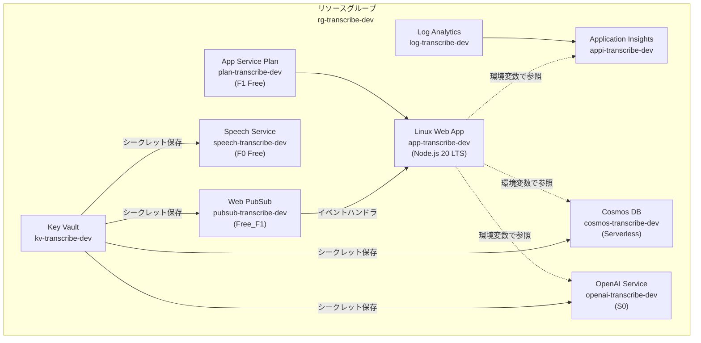

# Infrastructure as Code (Terraform) ドキュメント

> **対象プロジェクト**: リアルタイム文字起こし＆議事録要約 Web アプリケーション  
> **最終更新日**: 2026-04-25

---

## 1. 概要

本ディレクトリは、Azure 上に必要なインフラリソースを Terraform で宣言的に管理するための IaC（Infrastructure as Code）構成です。  
環境ごとの変数ファイル（`.tfvars`）を切り替えることで、開発・ステージング・本番環境を同一のコードベースからプロビジョニングできます。

---

## 2. ファイル構成

```
infra/
├── main.tf                  # プロバイダー設定・リソースグループ・共通ローカル変数
├── variables.tf             # 変数定義（デフォルト値付き）
├── app_service.tf           # App Service Plan + Linux Web App
├── cosmos_db.tf             # Cosmos DB アカウント・データベース・コンテナ
├── cognitive_services.tf    # Azure AI Speech Service + Azure OpenAI Service
├── web_pubsub.tf            # Azure Web PubSub + Hub 設定
├── monitoring.tf            # Application Insights + Log Analytics Workspace
├── key_vault.tf             # Azure Key Vault + シークレット自動登録
├── outputs.tf               # terraform apply 後に出力される値
└── environments/
    └── dev.tfvars           # 開発環境用パラメータ
```

### 各ファイルの役割

| ファイル | 内容 |
|:---|:---|
| `main.tf` | `azurerm` プロバイダーの設定、リソースグループの作成、全リソース共通のタグ定義 |
| `variables.tf` | プロジェクト名・環境名・リージョン・各 SKU 等の入力変数。デフォルト値は最安プラン |
| `app_service.tf` | Node.js 20 LTS を実行する Linux Web App。環境変数として各 Azure サービスの接続情報を自動設定 |
| `cosmos_db.tf` | Serverless モードの Cosmos DB。設計書に定義されたインデックスポリシーとコンポジットインデックスを適用 |
| `cognitive_services.tf` | Speech Service（F0 Free）と OpenAI Service（S0）。GPT-4o モデルのデプロイメントも含む |
| `web_pubsub.tf` | Web PubSub（Free_F1）と `transcription` ハブ。App Service のイベントハンドラ URL を自動設定 |
| `monitoring.tf` | Log Analytics Workspace と Application Insights。Node.js アプリケーション向けに設定 |
| `key_vault.tf` | Key Vault の作成と、各サービスの API キー・接続文字列をシークレットとして自動登録 |
| `outputs.tf` | apply 後に表示されるエンドポイント URL やリソース名 |

---

## 3. プロビジョニングされるリソース

### 3.1 リソース構成図



### 3.2 リソース一覧と SKU

| リソース | Terraform リソース名 | SKU / プラン | 月額目安 (dev) |
|:---|:---|:---|:---:|
| リソースグループ | `azurerm_resource_group.main` | — | ¥0 |
| App Service Plan | `azurerm_service_plan.main` | F1 (Free) | ¥0 |
| Linux Web App | `azurerm_linux_web_app.main` | — | ¥0 |
| Cosmos DB Account | `azurerm_cosmosdb_account.main` | Serverless | ¥0〜 |
| Cosmos DB Database | `azurerm_cosmosdb_sql_database.main` | — | — |
| Cosmos DB Container | `azurerm_cosmosdb_sql_container.sessions` | — | — |
| Speech Service | `azurerm_cognitive_account.speech` | F0 (Free) | ¥0 |
| OpenAI Service | `azurerm_cognitive_account.openai` | S0 | 従量課金 |
| OpenAI Deployment | `azurerm_cognitive_deployment.gpt4o` | Standard (1K TPM) | 従量課金 |
| Web PubSub | `azurerm_web_pubsub.main` | Free_F1 | ¥0 |
| Web PubSub Hub | `azurerm_web_pubsub_hub.transcription` | — | — |
| Log Analytics | `azurerm_log_analytics_workspace.main` | PerGB2018 | ¥0 (5GB/月無料) |
| Application Insights | `azurerm_application_insights.main` | — | ¥0 |
| Key Vault | `azurerm_key_vault.main` | Standard | ≒ ¥0 |

---

## 4. 前提条件

### 4.1 必要なツール

| ツール | バージョン | インストール |
|:---|:---|:---|
| Terraform | >= 1.5.0 | [公式サイト](https://developer.hashicorp.com/terraform/install) または `brew install terraform` |
| Azure CLI | >= 2.50 | [公式サイト](https://learn.microsoft.com/ja-jp/cli/azure/install-azure-cli) または `brew install azure-cli` |

### 4.2 Azure サブスクリプション

- 有効な Azure サブスクリプションが必要です
- OpenAI Service を使用するには、[Azure OpenAI へのアクセス申請](https://aka.ms/oai/access)が事前に承認されている必要があります

---

## 5. 使い方

### 5.1 初回セットアップ

```bash
# 1. Azure にログイン
az login

# 2. サブスクリプション ID を確認
az account show --query id -o tsv

# 3. dev.tfvars の subscription_id を書き換え
#    environments/dev.tfvars を開き YOUR_SUBSCRIPTION_ID を実際の値に置換

# 4. Terraform 初期化
cd infra
terraform init
```

### 5.2 プラン確認（ドライラン）

```bash
terraform plan -var-file=environments/dev.tfvars
```

> 実際にリソースは作成されません。作成・変更・削除される予定のリソースが一覧表示されます。

### 5.3 リソース作成

```bash
terraform apply -var-file=environments/dev.tfvars
```

`yes` を入力して確定すると、Azure 上にリソースが作成されます。  
完了後、以下の情報が出力されます：

```
Outputs:

app_service_url          = "https://app-transcribe-dev.azurewebsites.net"
cosmos_db_endpoint       = "https://cosmos-transcribe-dev.documents.azure.com:443/"
key_vault_name           = "kv-transcribe-dev"
openai_endpoint          = "https://openai-transcribe-dev.openai.azure.com/"
speech_service_region    = "japaneast"
web_pubsub_hostname      = "pubsub-transcribe-dev.webpubsub.azure.com"
```

### 5.4 リソース削除

```bash
terraform destroy -var-file=environments/dev.tfvars
```

> ⚠️ **注意**: すべてのリソースとデータが完全に削除されます。本番環境では絶対に実行しないでください。

---

## 6. 環境の切り替え

ステージング・本番環境を追加する場合は、`environments/` に新しい `.tfvars` を作成します。

```bash
# ステージング環境
terraform apply -var-file=environments/stg.tfvars

# 本番環境
terraform apply -var-file=environments/prod.tfvars
```

### 環境別の推奨 SKU

| サービス | dev (試用) | stg (検証) | prod (本番) |
|:---|:---|:---|:---|
| App Service | F1 (Free) | B1 (Basic) | S1 (Standard) |
| Cosmos DB | Serverless | Serverless | Provisioned (400 RU/s〜) |
| Speech Service | F0 (Free) | S0 (Standard) | S0 (Standard) |
| OpenAI | S0 / 1K TPM | S0 / 10K TPM | S0 / 80K+ TPM |
| Web PubSub | Free_F1 | Standard_S1 | Standard_S1 |

---

## 7. 注意事項・制限

### 7.1 F1 (Free) プランの制限

| 制限 | 影響 |
|:---|:---|
| **WebSocket 非対応** | Web PubSub からの直接接続が不可。ポーリングでの代替が必要 |
| **共有インスタンス** | パフォーマンスが不安定な場合がある |
| **カスタムドメイン非対応** | `*.azurewebsites.net` のみ |
| **常時接続なし** | 一定時間アクセスがないとアプリが停止（コールドスタート） |

> WebSocket を使用したリアルタイム通信を試す場合は、`dev.tfvars` の `app_service_sku` を `"B1"` に変更してください。

### 7.2 F0 (Free) Speech Service の制限

- 音声認識: **5 時間/月** まで
- 同時リクエスト: **1 件** まで
- 本格的なテストには S0 へのアップグレードが必要

### 7.3 Key Vault のシークレット

Terraform が各サービスの API キーを Key Vault に自動登録します。  
アプリケーション側から Key Vault を参照する場合は、App Service のマネージド ID を有効化し、Key Vault のアクセスポリシーに追加する必要があります（本構成では未設定）。

### 7.4 ステートファイル管理

現在の構成ではステートファイル（`terraform.tfstate`）がローカルに保存されます。  
チーム開発では **Azure Storage Account** にリモートバックエンドを設定することを推奨します。

```hcl
# 例: リモートバックエンド設定
terraform {
  backend "azurerm" {
    resource_group_name  = "rg-terraform-state"
    storage_account_name = "sttfstate"
    container_name       = "tfstate"
    key                  = "transcribe-dev.terraform.tfstate"
  }
}
```

---

## 8. トラブルシューティング

| 症状 | 原因 | 対処 |
|:---|:---|:---|
| `Error: creating OpenAI Account` | OpenAI アクセスが未承認 | [Azure OpenAI アクセス申請](https://aka.ms/oai/access)を完了する |
| `Error: Conflict - SpeechServices F0` | F0 は1サブスクリプションにつき1つ | 既存の F0 リソースを削除するか S0 に変更 |
| `Error: Key Vault name already exists` | Key Vault 名はグローバル一意 | `project_name` を変更してリソース名を一意にする |
| `terraform init` でプロバイダーエラー | azurerm バージョン不一致 | `terraform init -upgrade` を実行 |
| `apply` 後に Web App にアクセスできない | アプリコードが未デプロイ | インフラ作成後に別途 `az webapp deploy` でデプロイする |
